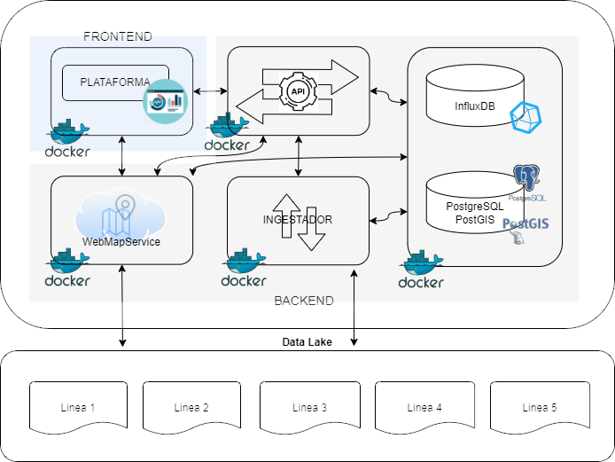

# HydroTwin (GemeloDigitalCHS)

## Arquitectura de software

### Tecnologías base

La plataforma se ha desarrollado en base a los principios tecnológicos de los sistemas de microservicios para poder aprovechar cualidades como escalabilidad, resiliencia y alta disponibilidad, a la par de un desarrollo ágil centrado en cada una de las necesidades de la propia plataforma. Para ello nos hemos valido de la tecnología de contenedores Docker en base Linux, sobre la que hemos construido imagenes personalizadas tanto para el frontend como el backend.

#### Frontend

El frontend es una "Single page application" desarrollada en base al framework Vue.js sobre Node, compilada y servida a través de Nginx, el cual también actúa de proxy inverso para poder acceder a otros servicios tales como la API (/api), el servicio de mapas (/wms) o una instancia de administración de bases de datos (/db-admin) para la gestión de la base de datos relacional interna.

#### Backend

El backend consta de varios microservicios y bases de datos que en conjunto ofrecen toda la funcionalidad necesaria para gestionar y ofrecer toda clase de información al frontend:

La API, desarrollada usando el framework Flask en base Python 3.8 y que aglutina todas las operaciones de interacción con otros servicios y las bases de datos, así como los modelos de predicción de la calidad del agua y simulacción de la red hidrológica de la cuenca.

El ingestador de datos del SAIH y la salida de las líneas 1 a 3, desarrollado integramente en Python 3.9 y que consta de tres scripts que se ejecutan en base a una programación temporal en _cron_.

El servicio de mapas GIS, apoyandonos en tecnología OpenDataCube y configurado para servir los tipos de mapas específicos de esta plataforma.

Las bases de datos InfluxDB y Postgis, siendo la primera una base de datos de series temporales basada en _buckets_ que alberga la información procesada que se ingesta del SAIH y la simulada de la línea 2. La base de datos Postgis se basa en PostgresDB con el componente Postgis para albergar información específica de mapas GIS, que contiene una estructura relacional de datos específicos de la cuenca.

### Diagrama de microservicios & datalake



Es muy importante que la estructura del _datalake_ siga el patrón 
{línea de producción}/{IN/OUT}/{PREDICC_M/S} o {SIMUL_M/S}/{año}/{mes}/{dia}(cuando corresponda)/
para el correcto funcionamiento tanto del servicio de ingesta como el de servidor de mapas y la api de la plataforma, ya que siguen este esquema para poder trabajar con la información generada por todas las líneas.

La estructura básica de carpetas se puede encontrar en el directorio _backend/geodata/_.

## Puesta en marcha

### Requisitos

Para desplegar la plataforma en un servidor se requiere de los siguientes puntos:
- Docker Engine v20.10.10+ instalado y configurado para correr como servicio ([https://docs.docker.com/engine/install/](https://docs.docker.com/engine/install/))
- La carpeta _HydroTwin_ o equivalente con los siguientes ficheros:
    ```Shell
    /HydroTwin/
    ├── .env
    ├── db-ops.sh
    ├── docker-compose.yml
    └── ssl_certs
        └── certificados_de_dominio.{crt/key/pem}
    ```
- En esa misma carpeta debe existir un fichero _.env_ generado a partir de la plantilla _.env.example_ y rellenado adecuadamente como mínimo con los campos requeridos.
- La carpeta o punto de montaje de lo que será el _datalake_ con la estructura necesaria (como en _backend/geodata/_ del código fuente).
- Los puertos 80/443 y a ser posible también el 8086 abiertos para poder acceder a la plataforma (y a la interfaz de administración de InfluxDB en el caso del 8086) una vez en marcha.

### Desarrollo

Aunque se puede trabajar en los diferentes servicios a nivel local, es preferible usar los propios contenedores de desarrollo, desplegables usando el fichero de composición _docker-compose.dev.yml_. Además, no es necesario configurar nada más, ya que toma los valores por defecto para inicializar.
```shell
docker compose -f docker-compose.dev.yml up -d
```

Si se decidiera trabajar localmente prescindiendo de los contenedores, habría que inicializar un entorno virtual en el caso de los servicios de backend:
```shell
cd backend/
python3 -m venv venv
source env/bin/activate
pip install --upgrade pip
pip install wheel
pip install -r api/requirements/dev.txt
pip install -r ingestor/requirements.txt
```
e iniciar alguno de los scripts:

`python api/api.py` o `python ingestor/{file_watchdog/ingestor/saih_elements_parser}.py`

y/o instalar los modulos de Node e inicializar en el caso del frontend:
```shell
cd frontend/
npm install
npm run serve
```

### Despliegue en producción

Para poner en marcha la plataforma en un entorno de producción, lo primero será asegurarnos de que los requisitos más arriba descritos se cumplen. Una vez estamos seguros, lo siguiente sería inicializar las bases de datos siguiendo los siguientes pasos:
- Iniciar primero únicamente los servicios de bases de datos: `docker compose up -d rdb tdb`
- Inicializar la base de datos de series temporales: `./db-ops.sh init tdb`
- Iniciar el servicio de mapas para que inicialice su base de datos: `docker compose up -d ows`
- Añadir los tipos de productos a la base de datos: `curl -X GET -L -k 'http://localhost/api/ows/add-all-products/'`
- Actualizar el servicio de mapas: `docker compose restart ows`
- Finalmente, iniciar el resto de servicios: `docker compose up -d`
